# Ecommerce Project


## Setup

- ```cd my-app```
- ```npm install```
- ```npm run dev```

<br><br>

## Dependencies

- Three.js:
    - ```npm install three @types/three @react-three/fiber```
    - ```npm i @react-three/drei```
- Redux (could also do npm installation):
    - ```npm install @reduxjs/toolkit react-redux```
- React webcam (for account page):
    - ```npm install react-webcam```

<br><br>

## Folder Structure

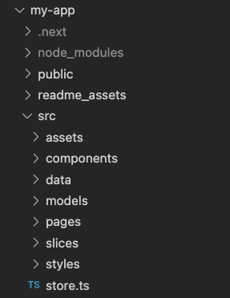<br>
- ```readme_assets```: a folder that contains image assets required for this README.MD file that you are reading through right now
- ```assets```: contains image assets required in the web app
- ```components```: contains the components of the application
- ```data```: contains the an array of product objects (lego, macbook, netflix, xbox)
- ```models```: contains interface models required throughout the application
- ```pages```: contains the pages of the web app
- ```slices```: contains the redux slices and reducers required to save and manipulate data in the app
- ```styles```: folder contains style file (not relavent)
- ```store.ts```: file contains the redux store which contains state, actions and reducers

<br><br>

## What you will see

Home Page (the cool rotatable cube made with react three fiber): <br>
Description: You will be greeted by my author of choice: Trikon. The backside will reveal the story of my author Trikon  <br>
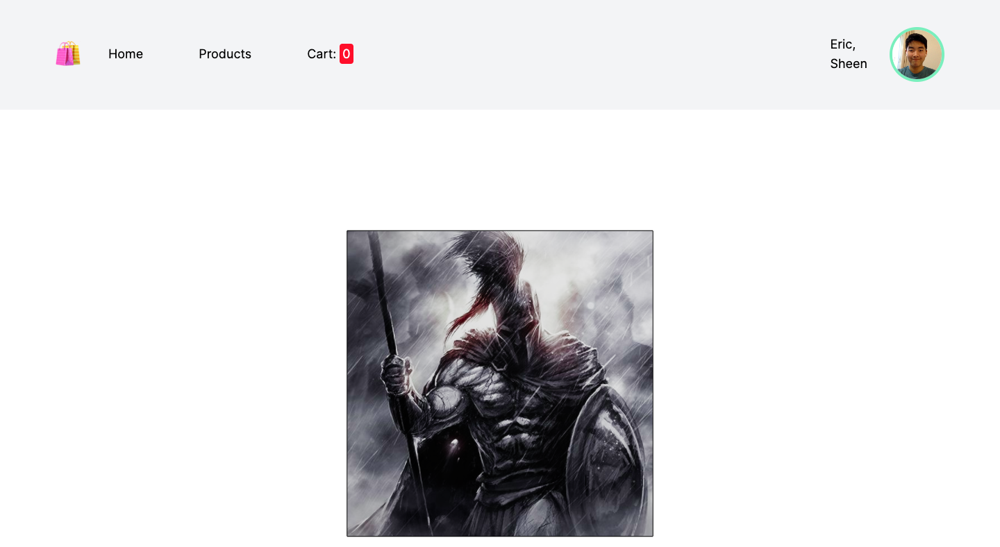<br>
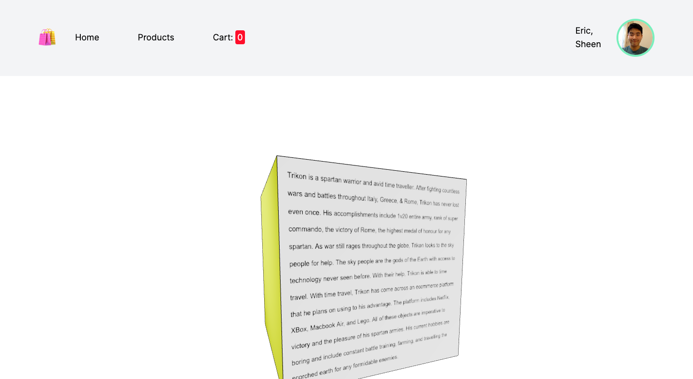<br>

Product Page: <br>
Description: The product page will showcase the different products you can buy. Just click on the image!<br>
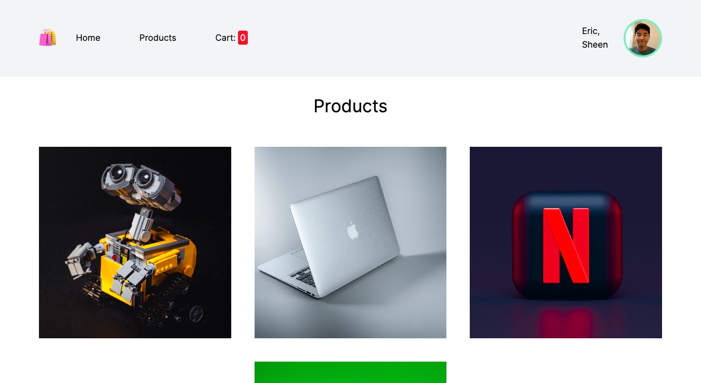<br>

Product Page Info: <br>
Description: Upon clicking on the product image you will be greeted by the product info page!<br>
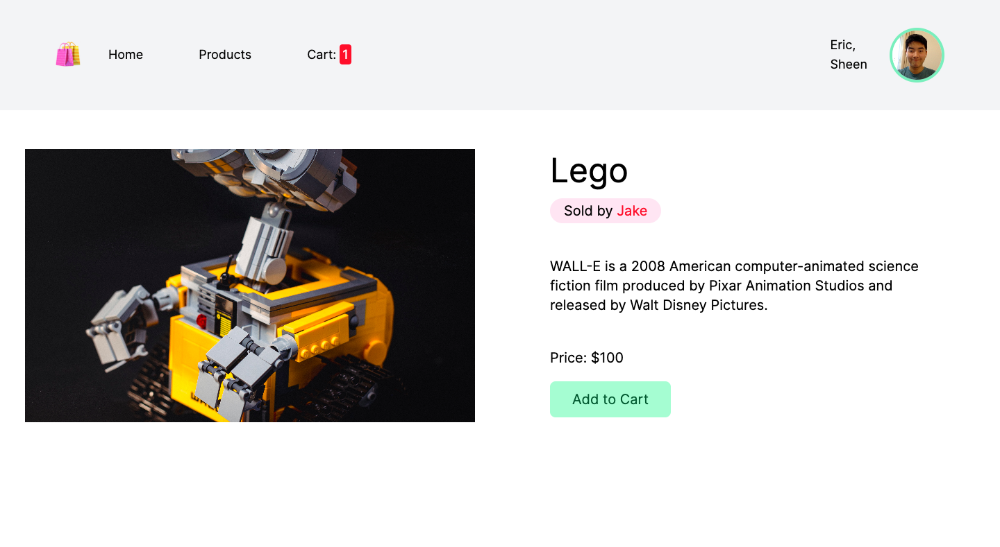<br>
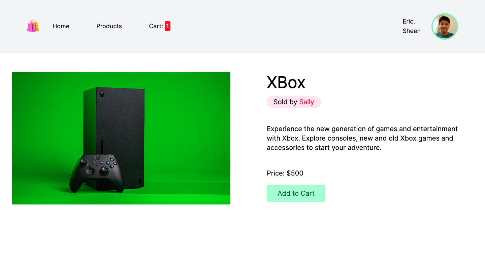<br>

Cart Page: <br>
Description: The Cart page showcases the total price (from all the products), and the number of products you bought! You can manipulate and remove items.<br>
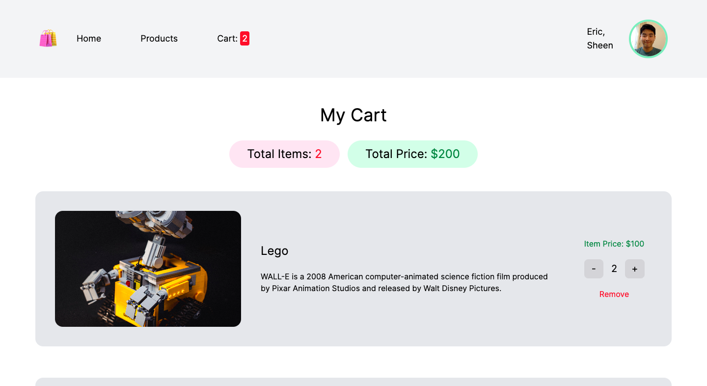<br>
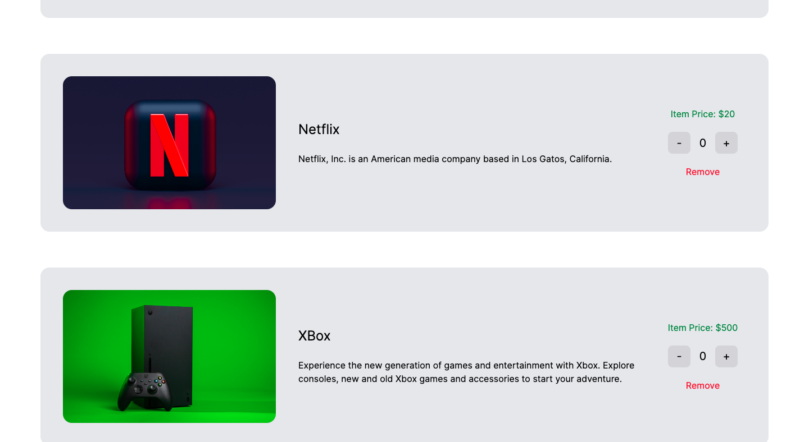<br>

Account Page: <br>
Description: This is the account page! When you click on "Update Picture", the webcam will activate and you can click on "Take Photo" to capture and update the new profile picture, OR, just cancel it if you clicked on it by accident. The input fields also update real-time when you change your first name to something like "New name."<br>
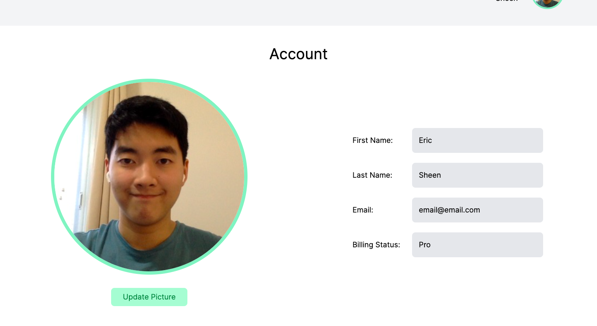<br>
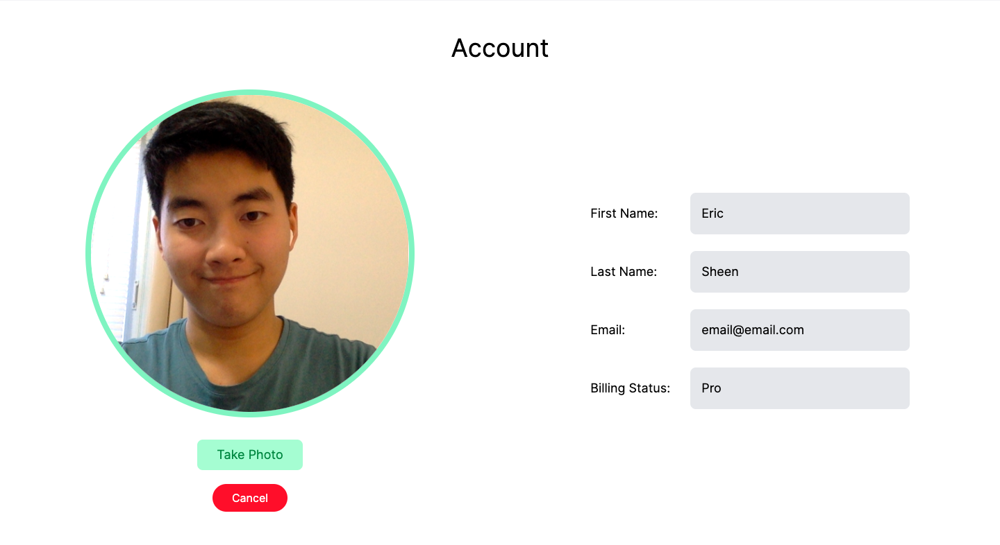<br>
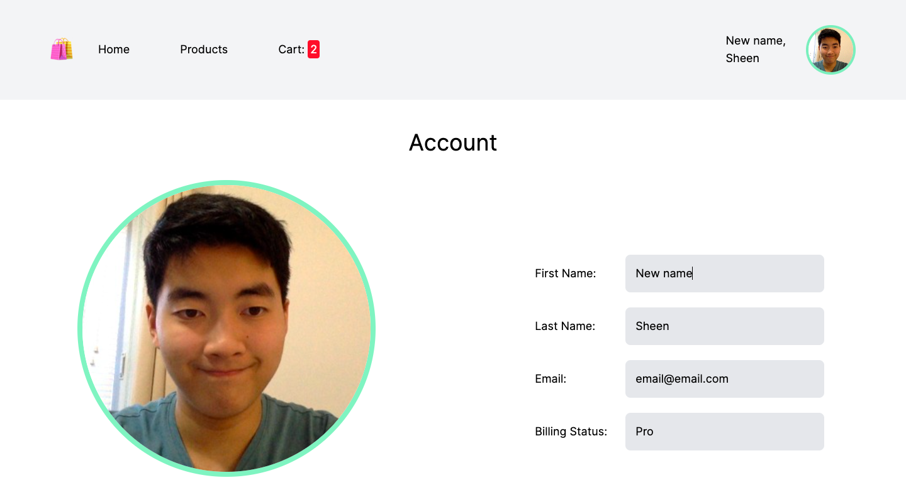<br>
