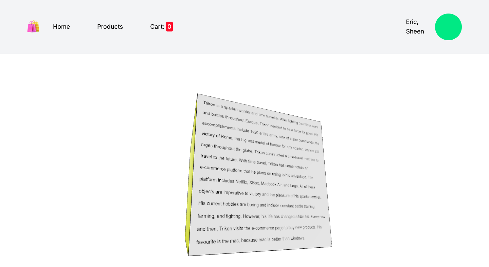

# Ecommerce Project


## Setup

- ```cd my-app```
- ```npm install```
- ```npm run dev```

<br><br>

## Dependencies

- Three.js:
    - ```npm install three @types/three @react-three/fiber```
    - ```npm i @react-three/drei```
- Redux (could also do npm installation):
    - ```npm install @reduxjs/toolkit react-redux```
- React webcam (for account page):
    - ```npm install react-webcam```

<br><br>

## Folder Structure

<br>
- ```readme_assets```: a folder that contains image assets required for this README.MD file that you are reading through right now
- ```assets```: contains image assets required in the web app
- ```components```: contains the components of the application
- ```data```: contains the an array of product objects (lego, macbook, netflix, xbox)
- ```models```: contains interface models required throughout the application
- ```pages```: contains the pages of the web app
- ```slices```: contains the redux slices and reducers required to save and manipulate data in the app
- ```styles```: folder contains style file (not relavent)
- ```store.ts```: file contains the redux store which contains state, actions and reducers

<br><br>

## What you will see

Home Page (the cool rotatable cube made with react three fiber): <br>
Description: You will be greeted by my author of choice: Trikon. The backside will reveal the story of my author Trikon  <br>
<br>
<br>

Product Page: <br>
Description: The product page will showcase the different products you can buy. Just click on the image!<br>
<br>

Product Page Info: <br>
Description: Upon clicking on the product image you will be greeted by the product info page!<br>
<br>
<br>

Cart Page: <br>
Description: The Cart page showcases the total price (from all the products), and the number of products you bought! You can manipulate and remove items.<br>
<br>
<br>

Account Page: <br>
Description: This is the account page! When you click on "Update Picture", the webcam will activate and you can click on "Take Photo" to capture and update the new profile picture, OR, just cancel it if you clicked on it by accident. The input fields also update real-time when you change your first name to something like "New name."<br>
<br>
<br>
<br>

<br><br>

## Instructions
- Author: Trikon (random name i chose) 
- Pages: Home, Products, Cart, Account, and Item page <-- navigation bar on the top of all pages
    - Home page: 
        - Three.js canvas spanning the full viewport
        - 3D cube show image of the author head-on on page load. Rotate cube to reveal a 150-word description of the chosen author, highlighting their works and life, on the backside.
            - 150 words: Trikon is a spartan warrior and time traveller. After fighting countless wars and battles throughout Europe, Trikon decided to be a force for good. His accomplishments include 1v20 entire army, rank of super commando, the victory of Rome, the highest medal of honour for any spartan. As war still rages throughout the globe, Trikon constructed a time-travel machine to travel to the future. With time travel, Trikon has come across an e-commerce platform that he plans on using to his advantage. The platform includes Netflix, XBox, Macbook Air, and Lego. All of these objects are imperative to victory and the pleasure of his spartan armies. His current hobbies are boring and include constant battle training, farming, and fighting. However, his life has changed a little bit. Every now and then, Trikon visits the e-commerce page to buy new products. His favourite is the mac, because mac is better than windows.
    - Product page: 
        - Multiple clickable tiles with the Book cover as a thumbnail. 4 item pages, each featuring a given book and containing the following data: title, author, price, quantity, thumbnail, and product description (see image-product)
    - Account page: 
        - User fields: first name, last name, email, billing status, and profile image. The user must be able to select the “update image” button and replace their current account image with a newly taken image (from their webcam).
        - Update their first name and last name (see image-account).
- Redux state management to create and manage two data slices. 
    - One slice called “Cart” will store the cart information, including; total-price and total-quantity. 
    - Second slice called “Profile”, which will store the current and updated user first-name, last-name, and profile-image-url. The user must be able to adjust the quantity of a given book in the cart and on the item page.
- Note: Only consider desktop layouts starting at a min-width of 950px
- Tailwind CSS to create a cohesive light theme design on all pages, you are encouraged to incorporate this design into the homepage canvas.